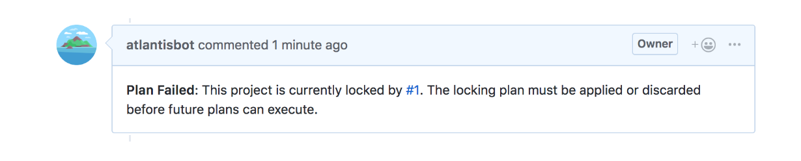

# Atlantis
- [github](https://github.com/runatlantis/atlantis), [main site](https://www.runatlantis.io/)

Atlantis는 pull request 기반으로 terraform plan 결과를 comment로 남겨주거나 지정한 설정으로 plan 및 apply부터 자동으로 pr merge까지 해주는 협업에 도움을 주는 소프트웨어이다. 
블로그의 첫글을 읽어보니 atlantis 개발자분이 hashicorp에 입사해 atlantis와 terraform이 더 협력 할 수 있는 프로젝트를 진행한다는 사실을 알게 되었다. 앞으로 terraform으로 IaaC를 하면서 더 많은 기능들이 추가 될 것 같다. 
atlantis는 사실 삼성전자의 송주영 선임분께서 aws 소모임에서 삼성전자 devops팀 이야기를 하실 때, lightning talk시간에 terraform 협업 관련해서 이것저것 조언을 구하다가 소개 받은 툴이다.
말 그대로 pull request를 hooking해 마치 자동 빌드 테스트 형태로 terraform plan을 해주고 결과를 pr comment로 보여주면서 reviewer가 직접 plan 결과를 실행하지 않고 바로 확인 할 수 있도록 해준다. 뿐만아니라 automerge 설정을 하면 모든 plan이 통과 됬을 때 자동으로 pr을 merge하는 기능도 있다.


IaaC 자체가 인프라에 직접적으로 영향을 주는 것이므로 특히 협업을 할 때 고려해야 할 부분이 많이 있다.
terraform내에서 지원하는 tfstate remote backend([hashicorp free remote state subscribe](https://app.terraform.io/signup) or s3, consul, ..)에서 관리하는 것 뿐만 아니라 나름의 staging전략을 사용 할 수 있는 workspace를 활용하는 것 dynamoDB등을 이용해 locking을 하는 것 그리고 terraform-docs를 활용한 문서화, 마지막으로 atlantis를 활용해 code review를 좀 더 편하게 하고 atlantis단에서의 locking도 활용해 보는 것들이 있을 것 같다.

## how atlantis works :: locking, plan, merge
atlantis에 의해 pull request로 plan이 이뤄지면 같은 directory, workspace는 해당 pr이 merge 되거나 plan을 manually하게 삭제되지 않는 이상 lock에 걸리게 된다. (물론 option을 주면 lock을 해제하고 plan 결과를 확인 할 수 있다.)
atlantis는 기본적으로 apply가 실패 할 것을 감안해 merge전에 apply를 실행하는데 master branch관점에서 봤을 때 locking을 통해 pr이 merge되기전 (project기준이 아닌 directory기준)최신 상태를 유지하도록 한다.  
만약 다른 pr에 의해 lock이 걸려있는 경우 다음과 같은 에러를 pr comment로 남겨준다.


atlantis는 pull request가 생성되거나 기존의 pr에 새로운 commit이 생겼을 경우 default로는 .tf 파일들만 filter한 후 파일이 위치한 경로에서 plan을 하는데 하위 dir level의 module이 변경 됬을 경우 상위 dir level로 이동하여 plan을 해준다.[atlantis autoplanning](https://www.runatlantis.io/docs/autoplanning.html)
이런 atlantis동작을 atlantis.yaml 설정을 통해 customizing 할 수 있다. 그건 아래에서 좀 더 자세하게 살펴보겠다.

atlantis는 모든 plan이 통과된다면 자동으로 pr을 merge 할 수 있는데 atlantis.yaml의 automerge값을 true 주거나 atlantis server 실행 시 ```--automerge``` option을 주면 된다.

## support git host list
atlantis는 다음의 git host를 지원한다.
  - github
  - gitlab
  - bitbucket

아래의 설치 과정은 github만을 다룬다. 다른 git host들에 내용은 홈페이지 guide에 자세한 내용이 나와 있다. [atlantis homepage guide](https://www.runatlantis.io/guide/)


## pre requirement
- terraform 
- git host account & repo

## quick start
```sh
// atlantis 설치 :: https://github.com/runatlantis/atlantis/releases 에서 최신 버전을 확인한다.
$ wget "https://github.com/runatlantis/atlantis/releases/download/v0.5.0/atlantis_darwin_amd64.zip"
$ unzip atlantis_darwin_am64.zip -d /usr/local/bin

// ngrok 설치
$ wget "https://bin.equinox.io/c/4VmDzA7iaHb/ngrok-stable-darwin-amd64.zip"
$ unzip ngrok-stable-darwin-am64.zip

// ngrok host name
$ ngrok http 4141
$ export URL="https://{YOUR_HOSTNAME}.ngrok.io"

// github webhook secret :: http://www.unit-conversion.info/texttools/random-string-generator/
$ export SECRET="{YOUR_RANDOM_STRING}"

// add webhook 
- Go to your repo settings
- Select Webhooks or Hooks in the sidebar
- Click Add webhook
- set Payload URL to your ngrok url with /events at the end. Ex. https://c5004d84.ngrok.io/events
- double-check you added /events to the end of your URL.
- set Content type to application/json
- set Secret to your random string
- select Let me select individual events
  - check the boxes
  - Pull request reviews
  - Pushes
  - Issue comments
  - Pull requests
- leave Active checked
- click Add webhook

// create access token :: https://help.github.com/en/articles/creating-a-personal-access-token-for-the-command-line#creating-a-token
$ export TOKEN="{YOUR_TOKEN}"

// start atlantis
export USERNAME="{the username of your GitHub}" // ex: dev-chulbuji
export REPO_WHITELIST="$YOUR_GIT_HOST/$YOUR_USERNAME/$YOUR_REPO" // ex: github/dev-chulbuji/infra
$ atlantis server \
  --atlantis-url="$URL" \
  --gh-user="$USERNAME" \
  --gh-token="$TOKEN" \
  --gh-webhook-secret="$SECRET" \
  --repo-whitelist="$REPO_WHITELIST"
```

## atlantis.yaml
atlantis 기본동작은 설정 할 수 있는 파일이다. v2부터는 project root에 위치 시켜 v1과는 다르게 project 단위로 나누어 설정한다.
```yaml
# example atlantis.yaml
version: 2
automerge: false # Automatically merge pull request when all plans are applied
projects:
- name: ec2
  dir: ./terraform/ec2
  workspace: dev
  terraform_version: v0.11.11
  autoplan:
    when_modified: ["*/*.tf*", "../modules/ec2/**.tf"]
    enabled: true
  apply_requirements: [mergeable, approved]
  workflow: dev
- name: ec2
  dir: ./terraform/ec2
  workspace: prod
  terraform_version: v0.11.11
  autoplan:
    when_modified: ["*/*.tf*", "../modules/ec2/**.tf"]
    enabled: true
  apply_requirements: [mergeable, approved]
  workflow: prod
workflows:
  dev:
    plan:
      steps:
      - run: my-custom-command arg1 arg2
      - init
      - plan:
          extra_args: ["-lock", "false"]
      - run: my-custom-command arg1 arg2
    apply:
      steps:
      - run: echo start apply dev env
      - apply
  dev:
    plan:
      steps:
      - run: my-custom-command arg1 arg2
      - init
      - plan:
      - run: my-custom-command arg1 arg2
```

### atlantis.yaml :: automerge
automerge는 새로운 pr이나 기존의 pr에 새로운 commit이 있을 시 모든 plan이 통과 됬을 때 자동 머지하는 기능이다.

### atlantis.yaml :: projects
atlantis.yaml을 통해 project라는 단위로 리소스 별 혹은 staging별로 구조를 나눌 수 있다.
```bash
.
└── project1
    ├── main.tf
    ├── production.tfvars
    └── staging.tfvars
└── project2
    ├── main.tf
    ├── production.tfvars
    └── staging.tfvars
```
가령 폴더 트리가 위와 같을 경우 
```yaml
version: 2
projects:
- name: prj1
  dir: ./project1
  workspace: staging
- name: prj2
  dir: ./project2
  workspace: production
```
위와 같이 project단위로 나눠 실행 설정을 달리 할 수 있다.

```bash
.
└── modules
    └── vpc
        ├── main.tf
└── vpc
    ├── vpc.tf
    ├── production.tfvars
    └── staging.tfvars
```
보통 terraform 프로젝트 구조를 보면 module 형태로 미리 정의된 resource 묶음을 사용하는 경우가 많은데 위와 같은 구조일 경우
project를 dir 단위로 나누면 project 경로 밖의 module에서의 코드 변화에 영향을 받을 수 없다.
```yaml
version: 2
projects:
- name: vpc
  dir: ./vpc # cannot find module
```
그래서 atlantis에서는 autoplan attribute에 사용하는 해당 module 경로의 tf을 명시해 줌으로써 module 코드 변화를 감지해 자동으로 ```terraform plan```을 실행 할 수 있도록 한다.
```yaml
version: 2
projects:
- name: vpc
  dir: ./vpc # cannot find module
  autoplan:
    when_modified: ["*/*.tf*", "../modules/vpc/**.tf"]
```

### atlantis.yaml :: apply_requirement
atlantis는 git host의 pull request 기반으로 locking뿐만 아니라 적어도 한사람에게 pr approved를 받고 [mergeable](https://help.github.com/en/articles/about-protected-branches) 할 때 apply 할 수 있도록 제어 할 수 있다.
```yaml
version: 2
projects:
- name: vpc
  dir: ./vpc # cannot find module
  autoplan:
    when_modified: ["*/*.tf*", "../modules/vpc/**.tf"]
  apply_requirements: [mergeable, approved]
```

### atlantis.yaml :: workflow
atlantis에서는 workflow를 활용해  built-in command 외에 custom script를 실행하거나 built-in command에 option을 주는 형태로 동작을 시킬 수 있다. 가령, terraform workspace로 staging 구성을 할 경우 dev, staging, prod별로 폴더를 따로 두지 않고 하나의 terraform file에 workspace를 통해 환경 별 terraform 구성을 할 수 있다. 이때 환경별로 .tfvars 파일을 ```-var-file``` option을 통해 각 환경에 주입하는데 atlantis에선 workflow를 활용해 command option을 줄 수 있다.
```bash
.
└── project1
    ├── main.tf
    ├── production.tfvars
    └── staging.tfvars
```
```yaml
version: 2
projects:
- name: vpc
  dir: ./vpc # cannot find module
  autoplan:
    when_modified: ["*/*.tf*", "../modules/vpc/**.tf"]
  apply_requirements: [mergeable, approved]
  workflow: staging
workflows:
  staging:
    plan:
      steps:
      - init:
        extra_args: ["-lock=false"] # -lock=false option
      - plan:
        extra_args: ["-var-file", "staging.tfvars"]
```
```yaml
# custom init/plan/apply & command
version: 2
projects:
- name: vpc
  dir: ./vpc # cannot find module
  autoplan:
    when_modified: ["*/*.tf*", "../modules/vpc/**.tf"]
  apply_requirements: [mergeable, approved]
  workflow: dev
workflows:
  dev:
    plan:
      steps:
      - run: terraform init -input=false -no-color
      - run: terraform workspace select -no-color dev
      - run: terraform plan -input=false -refresh -no-color
      - run: ./my-custom-script.sh
```

terraform을 운영하는 방식의 각 팀마다 달라 다양한 방식으로 운영 될 수 있다. 예를들어, remote state backend를 사용 할 때 terraform workspace에서 자동으로 workspace별로(env:/dev/.., env:/prod/..) state를 관리해주지만 경우에 따라 backend를 환경별로 다르게 가져 갈 수 있다. 
```hcl
// backend config
terraform {
  backend "s3" {
    bucket  = "${var.bucket_name}"
    key     = "${var.state_key}"
    region  = "${var.region}"
    encrypt = true
    dynamodb_table = "${var.lock_table}"
    acl = "bucket-owner-full-control"
  }
}

// staging.backend.tfvars
bucket_name="dj-staging-backend"
state_key="ec2/terraform.tfstate"
region="ap-northeast-2"
lock_table="dj-staging-lock-table"

// production.backend.tfvars
bucket_name="dj-production-backend"
state_key="ec2/terraform.tfstate"
region="ap-northeast-1"
lock_table="dj-production-lock-table"

// init cmd
$ terraform workspace select staging
$ terraform init -backend-config=staging.backend.tfvars

$ terraform workspace select production
$ terraform init -backend-config=production.backend.tfvars
```
이럴 경우 환경별로 ```terraform init```을 통해 remote state를 불러와야 하는데 atlantis의 custom command를 통해 다음과 같이 할 수 있다.
```yaml
version: 2
projects:
- name: vpc
  dir: ./vpc # cannot find module
  autoplan:
    when_modified: ["*/*.tf*", "../modules/vpc/**.tf"]
  apply_requirements: [mergeable, approved]
  workflow: dev
workflows:
  dev:
    plan:
      steps:
      - run: terraform init -backend-config=dev.backend.tfvars
```
```yaml
version: 2
projects:
- name: vpc
  dir: ./vpc
  autoplan:
    when_modified: ["*/*.tf*", "../modules/vpc/**.tf"]
  apply_requirements: [mergeable, approved]
  workflow: dev
workflows:
  dev:
    plan:
      steps: 
      - run: rm -rf .terraform
      - init: # built-in command
          extra_args: [-backend-config=dev.backend.tfvars]
```

Infrastructure as a Code를 통해 인프라를 코드로 관리하고 VCS를 통해 histroy를 남길 수 있으며 manual하게 관리 했을 때의 실수를 줄여 줄 수 있고 반복 작업에 굉장히 효율적이라는 여러 장점들이 있다. 하지만 여전히 production level에서 인프라에 직접적이다 보니 팀이 같이 협업하는 과정에서 고려 해야할 부분이 많고 이를 보안해주는 다양한 툴들이 나오고 있는 것 같다. Atlantis는 특히 terraform base의 IaaC에서 autoplanning 결과를 출력해 코드 리뷰에 자동화를 줄 수 있다는 점이 굉장히 편리한 것 같다. (test 환경에서 적용 후 자동으로 dev, staging, prod에 plan 결과를 볼 수 있는 것) 하지만 관리팀이 커진다면 atlantis단에서 locking은 생각보다 충돌이 많이 생길 것 같다는 생각도 드는데 좀 더 사용을 해보고 어떤식으로 적용을 할지 결정해봐야 겠다.